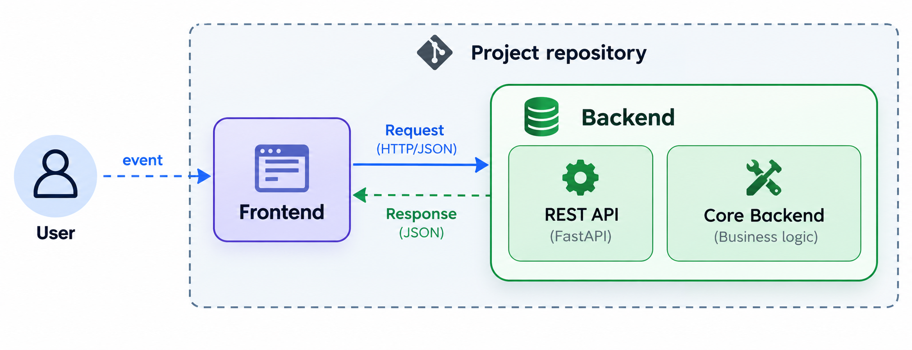
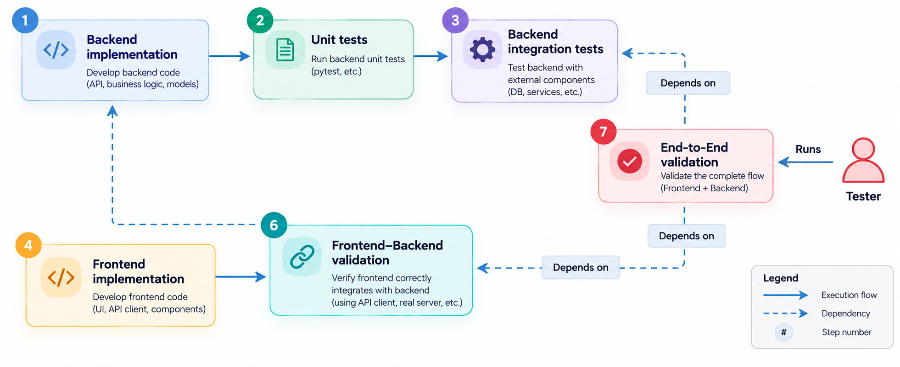
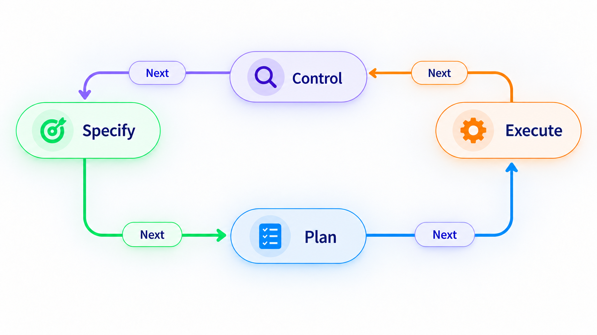
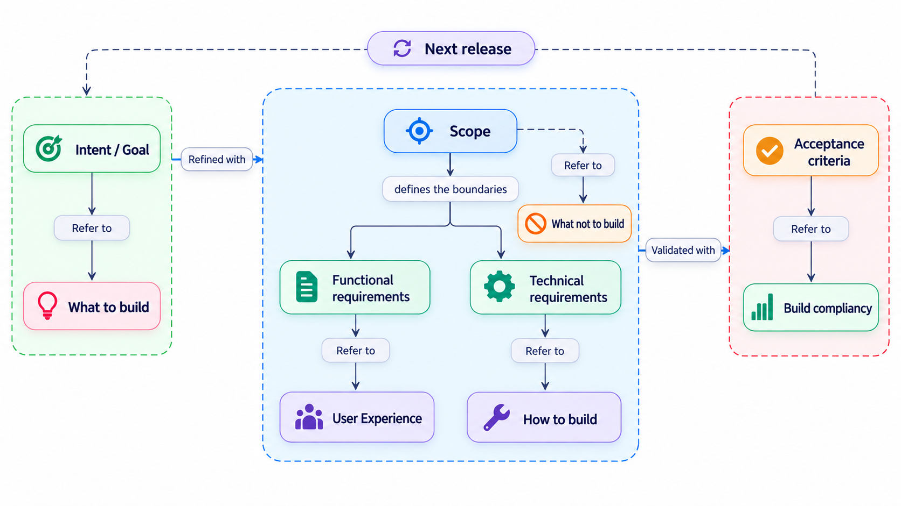
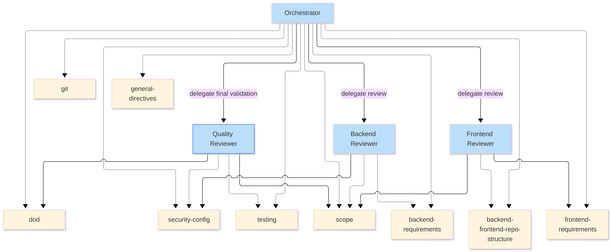
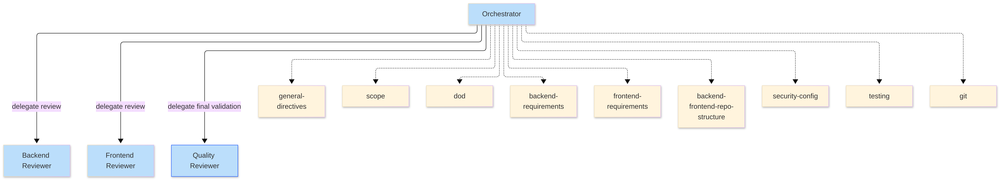
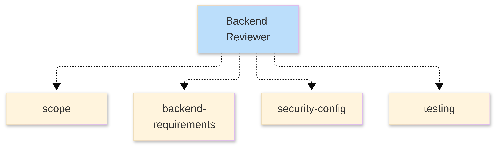
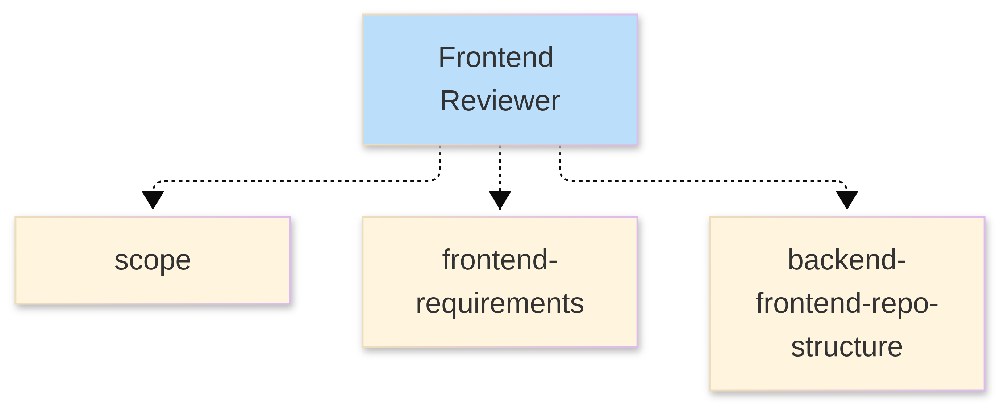
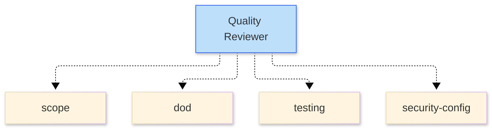

The agent-based engineering environment serves as a technological driver of value creation. 

This value depends on the company’s ability to : 
- Select the right use cases, 
- Integrate it into its development processes, 
- Govern its use, 
- Measure the benefits achieved.

> LLM + agentic platform → integration into SDLC → adoption & governance → measurable value.

# Business objective
Build an application that helps an agent to process customers tickets.

# High Level Design architecture


This illustration presents a **monorepository architecture** in which the **frontend** and **backend** are maintained within the same source-code repository. 

This type of organization is relatively common for projects of moderate complexity, 
especially when both parts of the application evolve closely together. 

It is not an anti-pattern; rather, it is a **trade-off between architectural scalability and development simplicity**.

One of the main benefits of a monorepository is that API contracts, shared models, integration tests and coordinated 
frontend/backend changes can all be managed within the same versioned codebase. 
This reduces the risk of inconsistencies between components and simplifies changes that span several layers of the application.

In this architecture, the **user** interacts with the **frontend**, which is responsible for presentation and user interaction. 
The frontend communicates with the backend through a **REST API**, here represented by a FastAPI implementation, using HTTP/JSON requests and responses.
The backend itself is divided into two main responsibilities: 
- the **REST API layer** which exposes the application interface and handles communication with the frontend, and 
- the **Core Backend**, which contains the business logic and application services. 

This separation preserves a clear boundary between API exposure and internal processing.


## Development process

The development process-here under is mapped with the architecture requirements meaning :
- REST API for frontend - backend communication
- Business logic is enclosed in the backend
- Frontend is responsible for user interactions and presentation




Step #6 is particularly relevant when the backend and frontend technologies are different, such as React+TypeScript for 
the frontend and Python for the backend.

End-to-end validation involves a human reviewer and takes place once the `backend integration tests` and `frontend-backend 
validation` (step 6) have been successfully completed.


In such a technology stack configuration, there is no simple way to automatically ensure client-server compatibility. 
Fortunately, `Orval` is one of the tools that can help make the integration of these two components more robust.

Step #7 of the development process ensures that the implemented solution complies with the scenarios and use cases 
defined in the specifications. For example, it is a milestone in an iterative process, such as the sprint demo in a 
Scrum workflow. 


It is recommended to define both the objective at the very beginning of development and the acceptance criteria that 
mark the end of a stage in the development process.


# Vibe Engineering

This process is essentially iterative.

**Why ?**

> Because, a step-by-step process allows for precise control over the activity of AI programing 
agents—that is, the code they generate—by controlling the context provided to them.
> 
> But also, when dealing with complex problems, it’s often difficult to specify everything in advance and come up with 
> a solution on the first try that meets all the requirements. 
> Methods such as the V-model have proven inadequate in the past and have given way to iterative methods that approach 
> the solution to a problem step by step.

**Who ?**

> Final inspection is essentially a human process, whereas intermediate inspection can be automated.
> 
> Human part of the control is ensured by the designer / architect, the one who emit the intent. 
> He may also be assisted by an 
> AI controler agent  whom relevant human context is provided.



Let's regard AI programing agents dedicated to “vibe-coding” as tools that facilitate a process defined by the architect.

I highly recommend creating a **map of the development process**, and then designing the “vibe-coding" agents that 
handle each step of that process.


## Specification Driven Development (SDD)
Providing a code-assistance AI (such as GitHub Copilot, Mistral-Vibe or Claude Code) with a specification 
document structured into three parts (Intent, Requirements, Acceptance Criteria) is the foundation 
of the Spec-Driven Development (SDD) methodology.
> https://github.com/github/spec-kit

The toolkit `Spec-Kit` helps structuring a such document. However, understanding the SDD process in 
its entirety allows for more effective use of this tool.

### Specify

This first step starts with feeding AI programing agents with specifications.

Specifications are the basement of the SDD process.

**Why ?**

> **Context is all what AI needs**.
> 
> Generative AI writes **plausible code** only. But plausibility do not involve neither compliancy with the global **business intent** 
> nor consistency with the **global architecture**. The generated artifacts only depends on provided context.
> 
> The context influences a probabilistic code-generation process. This non-deterministic aspect can only be 
> controlled through rules that govern this process. 
> The context essentially refers to the information that the generative AI does not (yet) have at the time it is asked 
> to perform a task, and which the **architect provides**.
> 

Diagram here-under shows the structure of such information provided to the generative AI divided into 3 macro-blocs :
- The **Intent** bloc for defining what to build
- The **Requirements** compounding :
  - Functionalities describing user experience (user in the sens of actor(s) interacting with the solution)
  - Technical specifying which technology, architecture patterns, scalability, observability...
  - Scope specifying what not to build
- **Acceptance criteria** specifying the criteria for the solution to be compliant with requirements and intents

The links `Refined with`, `Validated with` and `Next release` are inter macro-bloc relationships.

This processus is iterative. Intents, Requirements and Acceptance criteria may evolve along with the solution 
roadmap.


In the absence of such a framework, an AI programing agent —which relies on an optimized likelihood process— 
has **considerable leeway** for interpretation. Such structured specifications are constraints 
**reducing this interpretation space**. 

For each iteration step, structured specification aim to control the risks for :


| Principle | Description | Risks |
|---|---|---|
| **Completeness** | Some requirements, expected behaviors, or edge cases may be missing from the implementation. | Implementation partially fulfills the specification and then fails in unhandled scenarios. |
| **Compliance with intent** | The solution may be technically functional while failing to deliver the expected business intent or value. | The implementation runs, but solves the wrong problem or only partially addresses the actual need. |
| **Consistency** | Different parts of the system may be individually valid but incompatible when integrated. | For example, frontend and backend components may each pass their unit tests while failing in end-to-end integration tests. |
| **Scope** | Unvalued parts of the system such as external depedencies may be implemented. | Over-engineering, superfluous elements / unnecessary features that lead to problems with maintainability and functional scalability |
| **Verifiable** | Specification of explicit creteria. | Consistence of the spécification; align all of the generated code with the desired business value |

**The Mermaid diagram**
```text
---
config:
  theme: base
---
flowchart TB
    O["Orchestrator"] -- delegate review --> B["Backend Reviewer"] & F["Frontend Reviewer"]
    O -- delegate final validation --> Q["Quality Reviewer"]
    O -.-> GD["general-directives"] & S["scope"] & D["dod"] & BR["backend-requirements"] & FR["frontend-requirements"] & BFS["backend-frontend-repo-structure"] & SEC["security-config"] & T["testing"] & G["git"]
    B -.-> S & BR & SEC
    F -.-> S & FR & BFS
    Q -.-> S & D & T & SEC

    style O fill:#BBDEFB
    style B fill:#BBDEFB
    style F fill:#BBDEFB
    style Q stroke:#2962FF,fill:#BBDEFB
```

### Plan

It is easier to read and understand a plan—which is an abstract representation of the final 
implementation—than to read and understand thousands of lines of code. A plan is expressed 
in everyday language and can be refined and clarified at the architect’s request.


Planning the implementation is a step left to the programing assistant. 

However, in order to carry out the plan, the programing assistant may be guided by the architect to ensure control 
over the checkpoint in the overall process: `Specification → Planning → Execution → Control -> ...` 

> A way to keep control over this process, consist in applying constraints over the plan by requesting it to be 
> built with a dedicated structure.
> 
> For example, for the front-end/back-end solution to be developed, you can ask the AI programing assistant to build 
> the plan in four steps —such as the backend, the frontend, backend/frontend integration 
> and end-to-end testing— and to provide the AI programing agent with the Mermaid diagram of the overall 
> High Level Document (HLD) architecture.
> 
 

### Execute

The plan guides the execution of the AI programming assistant. 

The assistant interprets the steps, breaks them down into tasks.

Most of them manage specialized **Skills** and **Subagents**.

Mécanismes de délégation, gestion du contexte, parallélisation, outils et supervision de l'exécution


#### Skills

In practice, a Skill is a way of capitalizing on engineering practices. Its structure is standardized :
- A Markdown format
- A YAML frontmatter
- A textual description

Some Skills aimed to be reused across projects.

Programming assistant uses the available skills and tools, runs the tools, observes the results obtained, 
and adapts the control flow based on those results.

#### Subagents
Subagents are controlled by the AI programming assistant.
A subagent owns its context. It performs specialized tasks within the implementation process and return results to 
the orchestrator agents.

#### The agentic harness

The quality of coordination among sub-agents depends on both : 
- the reasoning capabilities of the underlying LLM and 
- the capabilities of the orchestrator agent on which the programming assistant relies, namely : 
  - delegation mechanims
  - context management, 
  - parallelization, 
  - tools.


# Applied Agentic architecture
This architecture is designed to match with the HLD Architecture.




---

## `orchestrator` agent

Orchestrator agent :
- delegates to specialized agents the review of the implementation of architectures blocks.
- 




This is the entry point for agentic vibe-coding.
It manages the three other agents : `backend-reviewer` agent, `frontend-reviewer` agent and `quality-reviewer` agent.
---

## `backend-reviewer` agent




This agent is in charge for reviewing the backend implementation.

Reviewing stands for, while taking into account `backend-requirements` skills :
- Checking for requirements specified into `scope` skills
- Passing tests related to backend implementation according to `testing` skills
- Checking for security requirements according to `security-config` skills


## `Frontend-reviewer` agent



Skills related to `Frontend-reviewer` exclude security and testing that have been considered as out-of-scope.

## `Quality-reviewer` agent



As an exemple of the prompt requesting the AI programing agent to build the plan :
```text
1. Read specifications contained into document ./specs/specs.md and also the High Level Design 
content into the mermaid document ./specs/hld.mmd
2. From this contents, build a plan for implementing what is specified
3. The plan is stepped in 4 parts in accordance with sections into ./specs/hld.mmd document :
    3.1 Setup the file organization
    3.2 Make backend implementation
    3.3 Make frontend implementation
    3.4 Make backend/frontend implementation
```

